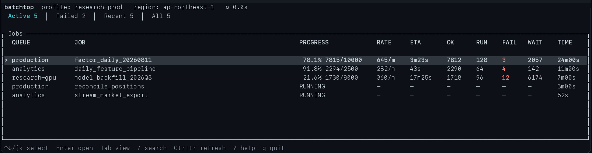

# batchtop

`batchtop` is a read-only, keyboard-first AWS Batch TUI focused on Array Job progress and failed-child logs.



```bash
batchtop --profile [YOUR_AWS_PROFILE] --region [YOUR_AWS_REGION]
```

See other options on `batchtop --help`.

## Install and run

Requires Rust 1.94 or later.

```bash
cargo install --git https://github.com/ki-chi/batchtop --locked
batchtop
```

## Keys

| Key | Action |
|---|---|
| `j` / `k`, `↑` / `↓` | Move |
| `Enter` | Open selected job or child |
| `Esc` | Back / cancel search |
| `Tab` / `Shift+Tab` | Next / previous tab |
| `/` | Search current view |
| `Ctrl+r` | Refresh current view |
| `?` | Help |
| `q` | Quit |

Array Jobs: `c` Children, `f` Failures, `p` Parameters. Child filters: `a` All, `r` Running, `w` Waiting, `f` Failed, `s` Succeeded.

Job detail: `l` Logs, `p` Parent/back.

Logs: `f` follow, `g` / `G` top / bottom, `n` / `N` next / previous match.

The test suite uses mocks and fixtures only; it never contacts AWS.
